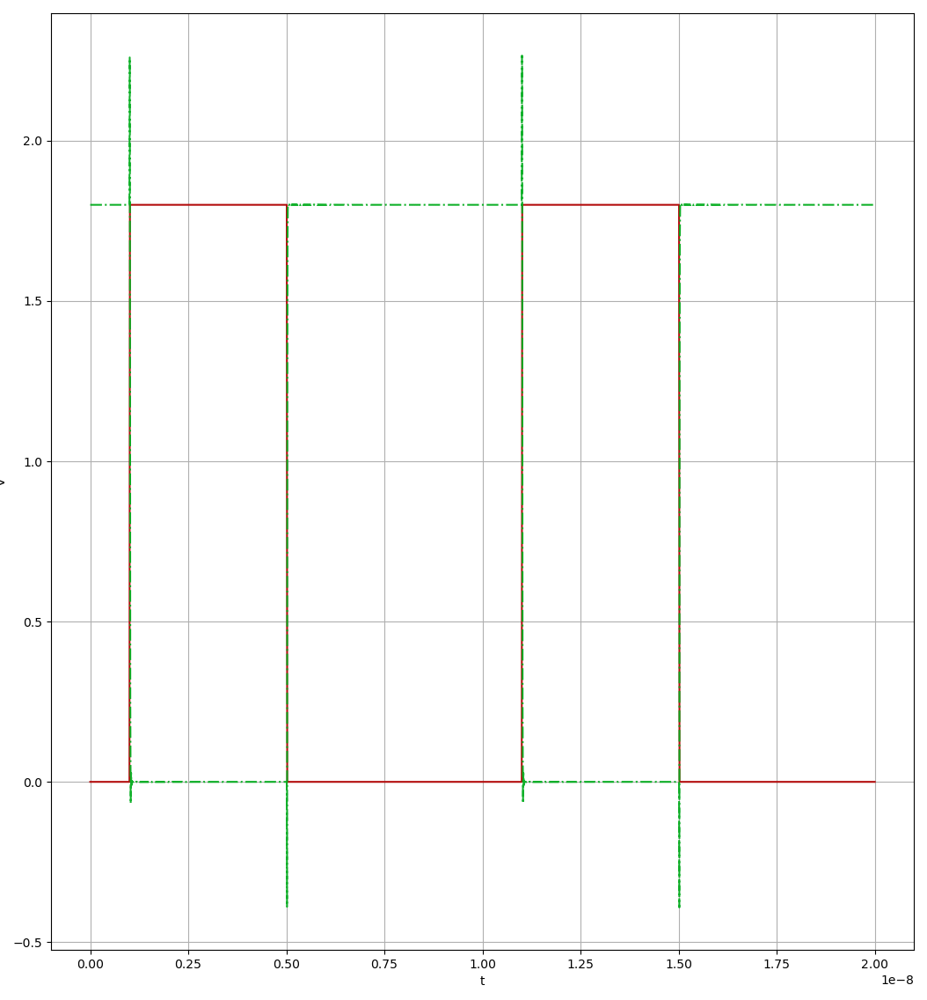
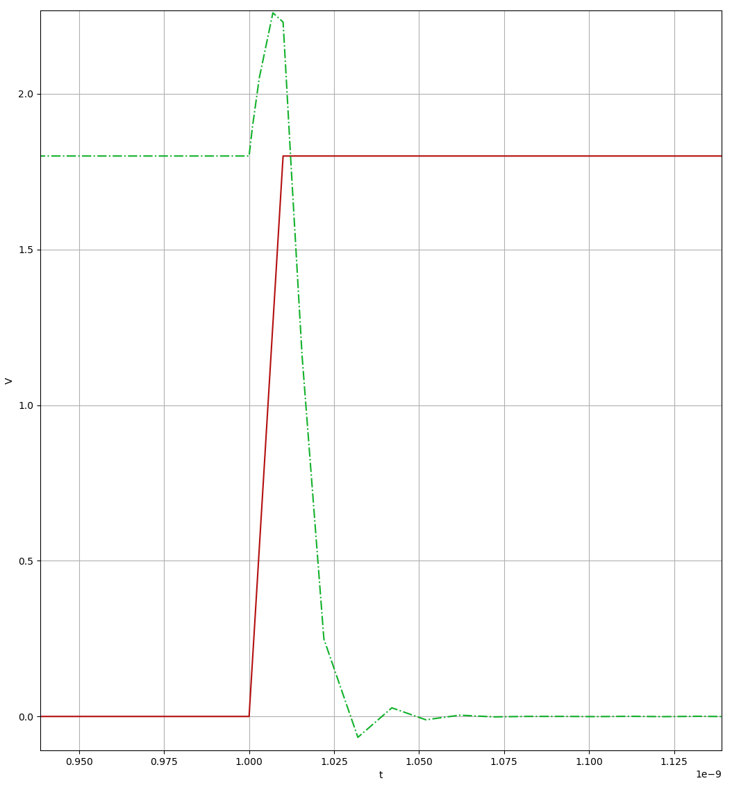

=============
CMOS Inverter
=============

The inverter
============
The inverter is a standard CMOS design.  There is a NFET and a PFET connected
with their drains tied together.  This is the output.  The source of the NFET is
connected to ground and the source of the PFET is connected to :math:`V_{DD}`.

.. image:: ./cmos-inverter.png

If you look at the schematic, you will see that the channel width of the PFET is
much wider than that of the NFET.  The reason is that we want voltages below
:math:`0.9\,\mathrm{V}` to be interpreted as a logic level LOW and otherwise
logic level HIGH.  To ensure this, we must make sure our transistors match in
conductivity.  The reason why the PFET is wider is because the mobility of holes
is much less than the mobility of electrons in the NFET.  To ensure they respond
similarity to the same potential difference we must ensure the ratios of widths
of the FETs match the ratios of the mobilities of the charge carriers.

Since this is my first time doing this, I just did trial and error until I got
close enough to the target.

Magic and layouting
===================
Layouting
---------
First of all note that the silicon wafer is not intrinsic and is actually doped,
making it a p type substrate.

NMOS
~~~~
To make an n-channel MOSFET, we first need to create... an n-channel using n
type silicon as a channel.  We dope a section of the substrate which forms the
channel.  Now we use a layer of polysilion on the channel which forms the gate.

PMOS
~~~~
Similarily to make a p-channel MOSFET, we need to make a p-channel using p type
silicon.  However since the substrate is already p-type, making it directly can
cause issues, so we need to isolate the p-channel using an n-type doped region
called n-well.  Now we can make the p-channel and use polysilicon again as the
gate.

Vias
~~~~
Metal interconnects are connected to the doped silicon layers underneath using
vias.  The layer order is as follows::

    metal1 -> viali -> locali -> [np]dconnect -> [np]-diffused

Using Magic
-----------
Magic is a VLSI layout tool based.  The primitive in magic, is the box.  It is
an axis aligned box, in which layers can be painted in.  It automatically detects
the layers (as transistors) and can identify connections.  It can then extract
parasitics and form netlists.

Magic is very keyboard focused.  For example, ``s`` selects the region as a box.

Labels and ports
~~~~~~~~~~~~~~~~
Magic uses labels to label a node in the netlist.  It uses ports to determine
the input and output of the layout.  The ports are used to denote the external
connections.

Magic automatically labels entire separate regions with the same label, if it can
determine if they are electrically connected or not.  In my initial trial, magic
didn't label the ``output`` and the power ports properly because I didn't make
the vias properly.

Extracting parasitics
=====================
After the layout is done, magic can export a ``.ext`` file which contains all
information about the parasitics about the layout.  For example it computes all
the resistances, capacitances, inductances and exports it.  It then can generate
a ``subckt`` netlist from this file which can then be tested.

Results
-------
Since this was my first layout, and I made it in about an hour, I didn't expect
good results.  Here is the output of the inverter in response to a square wave
input.

Zooming into one of the rising edges of the clocks, you can clearly see that the
output doesn't change immediately as soon as the input crosses the
:math:`0.9\,\mathrm{V}` threshold.  It takes time to do so, it is because of the
capacitance.

The output also overshoots :math:`1.8\,\mathrm{V}` because of capacitive
effects.

Conclusion
==========
That about concludes my VLSI experimentation for now.
