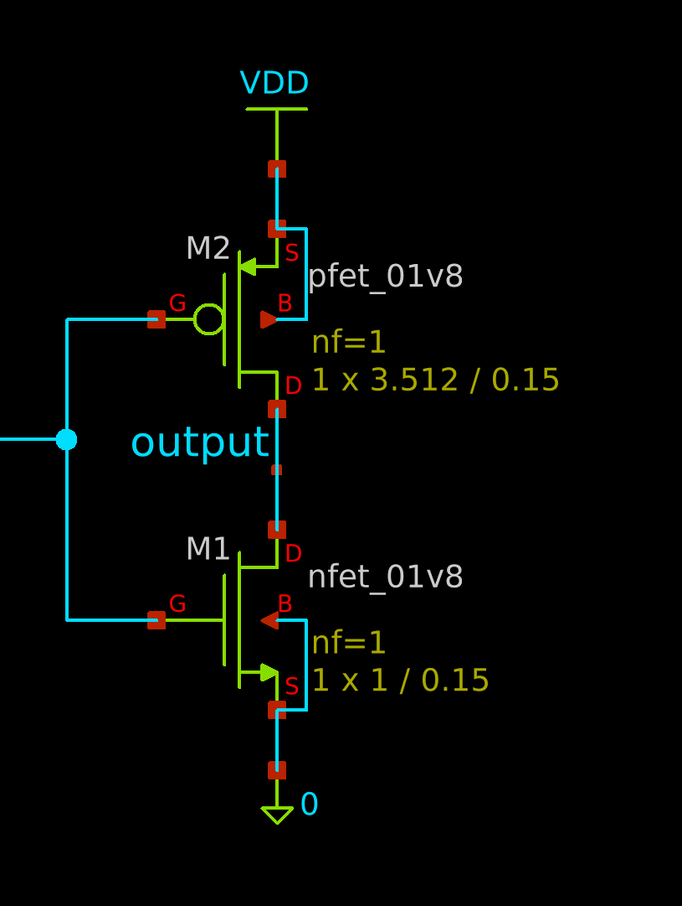

=============
CMOS Inverter
=============

The inverter
============
The inverter is a standard CMOS design.  There is a NFET and a PFET connected
with their drains tied together.  This is the output.  The source of the NFET is
connected to ground and the source of the PFET is connected to :math:`V_{DD}`.

If you look at the schematic, you will see that the channel width of the PFET is
much wider than that of the NFET.  The reason is that we want voltages below
:math:`0.9\,\mathrm{V}` to be interpreted as a logic level LOW and otherwise
logic level HIGH.  To ensure this, we must make sure our transistors match in
conductivity.  The reason why the PFET is wider is because the mobility of holes
is much less than the mobility of electrons in the NFET.  To ensure they respond
similarity to the same potential difference we must ensure the ratios of widths
of the FETs match the ratios of the mobilities of the charge carriers.

Since this is my first time doing this, I just did trial and error until I got
close enough to the target.

Magic and layouting
===================
Layouting
---------
First of all note that the silicon wafer is not intrinsic and is actually doped,
making it a p type substrate.

NMOS
~~~~
To make an n-channel MOSFET, we first need to create... an n-channel using n
type silicon as a channel.  We dope a section of the substrate which forms the
channel.  Now we use a layer of polysilion on the channel which forms the gate.

PMOS
~~~~

Vias
~~~~

Using Magic
-----------

Extracting parasitics
=====================

Results
-------
