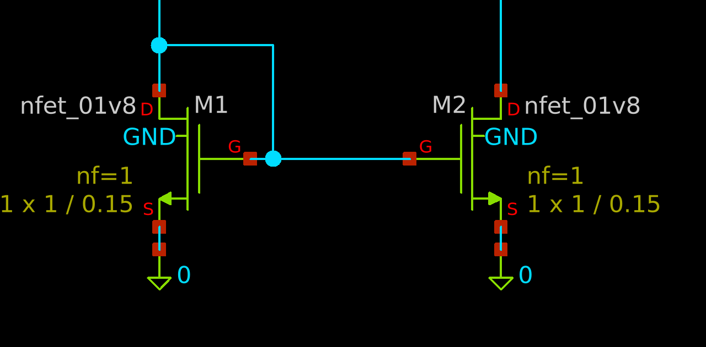
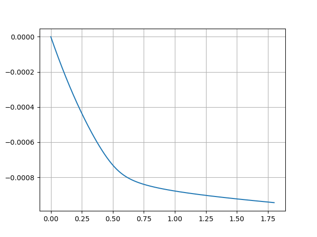

==============
Current Mirror
==============

Introduction
============
A current mirror is a common device which does exactly what its name implies...
it mirrors currents from one transistor's channel to another.

Here the left FET is the one detecting the current and then the right FET
mirrors the current.  The current is :math:`1\,\mathrm{mA}`.  Now the
:math:`V_{DD}` for the RHS FET is swept from :math:`0\,\mathrm{V}` to
:math:`1.8\,\mathrm{V}`, and we get the following I-V graph:

Why is it *not* constant?  Also note that the current values are negative since
I measured the current by referencing the source and ``ngspice`` takes current
coming out of the positive terminal as negative.

MOSFET parameters
=================
Let us compute the MOSFET parameters for the standard NFET in Sky130 PDK.
I will also make a lot of approximations so bear with me.

We are given the following data about said MOSFET:

* :math:`W = 1\,\mathrm{\mu m}`, the channel width.
* :math:`L = 0.15\,\mathrm{\mu m}`, the channel length.
This fits into the ``sky130_fd_pr__nfet_01v8__model.62`` model.

* Also, since the FET body is connected to its source, we have:

    * :math:`v_{TH} = V_{TO}`.
    * :math:`\chi = 0`.

Threshold voltage
-----------------
It appears that the exact ``vth0`` defined in the parameter is extremely complex
(not really a surprise since these are meant to be accurate to real silicon)::

    + vth0 = {3.188143043e-02+MC_MM_SWITCH*AGAUSS(0,1.0,1)*(sky130_fd_pr__nfet_01v8__vth0_slope/sqrt(l*w*mult))} lvth0 = 5.379559551e-08 wvth0 = 5.328136997e-07 pvth0 = -6.543061450e-14

The actual :math:`V_{th0}` is given by:

.. math:: V_{th0} = \text{vth0} + \frac{\text{lvth0}}{L}
                  + \frac{\text{wvth0}}{W}
                  + \frac{\text{pvth0}}{L\cdot W}

This gives us :math:`V_{th0} = 0.48712833686333334\,\mathrm{V} \approx 0.49\,\mathrm{V}`.

And hence:

.. math:: v_{TH} = V_{TO} = V_{th0} = 0.49\,\mathrm{V}.

Drain-source saturation current
-------------------------------
Next we shall compute :math:`I_{DSS}`, the drain-source saturation current, given by:

.. math:: I_{DSS} = \frac{1}{2}\mu C_{ox}\frac{W}{L}(1 + \lambda v_{ds})V_{TO}^2.

From the model parameters, we have:

* :math:`C_{ox} = 0.008111186113789777\,\frac{\mathrm{F}}{\mathrm{m}^2}`.
* :math:`\mu = 0.026355121218933332\,\frac{\mathrm{m}^2}{\mathrm{V}\cdot\mathrm{s}}`.
* :math:`\lambda \approx 0.0943778424237546\,\mathrm{V}^{-1}`.

From this, we finally have:

.. math:: I_{DSS} &= 0.00016908882935245012\times(1 + 0.0943778424237546\times v_{ds})\,\mathrm{A}.  \\
          I_{DSS} &\approx 1.7\times 10^{-4}\cdot(1 + 9.43\times 10^{-2}\cdot v_{ds})\,\mathrm{A}.

Current mirror analysis
=======================
The sense NFET (LHS) has the drain and gate pins connected together.  Because of
this, we have:

.. math:: v_{DS} = v_{GS}.

And more importantly, from the condition of the MOSFET to be in active region:

.. math:: v_{DS} &\geq v_{GS} - v_{TH}, \\
          0      &\geq - v_{TH}, \\
          0 &\geq -0.49.

Which is *always* true.  Hence the sense FET is always in its active region of
operation.  Note that we can completely ignore the existence of the sense NFET
(RHS) simply because of the approximation :math:`I_G \approx 0`.

Gate-source voltage of the sense FET
------------------------------------
We need to compute :math:`v_{GS}` for the sense FET.  We have :math:`I_D` already
because it is equal to the sense current, :math:`I_D = I_s = 1\,\mathrm{mA}`.
Using the square law relation, with :math:`I_{DSS}` already substituted:

.. math:: I_D = 1.7\times 10^{-4}\cdot(1 + 9.43\times 10^{-2}\cdot v_{DS})
              \left(1 - \frac{v_{GS}}{v_{TH}}\right)^2.

Since we already have :math:`v_{DS} = v_{GS}`, we can simply substitute :math:`v_{DS}`:

.. math:: I_D = 1.7\times 10^{-4}\cdot(1 + 9.43\times 10^{-2}\cdot v_{GS})
              \left(1 - \frac{v_{GS}}{v_{TH}}\right)^2.

Solving for :math:`v_{GS}` now gives:

.. math:: v_{GS} = (-10.4799971021746, -0.742340669887821, 1.59788390143673)

The only value that is physically possible here is:

.. math:: v_{GS} = 1.59788390143673\,\mathrm{V}.

This :math:`v_{GS}` will be the same for both FETs since their gates and sources
are tied together.

Explaining the initial steep rise
---------------------------------
In the graph, you see a steep rise in the current.  This is because the mirror
NFET is in its "Triode" region of operation (a.k.a. Ohmic region).

We can find for what range of :math:`V_{DD}` does the mirror FET stay in the triode
region, by using the formula:

.. math:: v_{DS} < v_{GS} - v_{TH}.

Substituting the value of :math:`v_{GS}` and :math:`v_{TH}`, we get:

.. math:: v_{DS} < 1.597 - 0.49 \approx 1.11\,\mathrm{V}.

Note that :math:`v_{DS} = v_{DD}`, which is our voltage source which is getting
sweeped from :math:`0 \to 1.8` volts.  So below :math:`1.11\,\mathrm{V}`, we expect
a steep almost linear increase in current, which is roughly what we see.

The almost constant current
---------------------------
This part is actually easy to explain.  Again starting with this equation:

.. math:: I_D = 1.7\times 10^{-4}\cdot(1 + 9.43\times 10^{-2}\cdot v_{GS})
              \left(1 - \frac{v_{GS}}{v_{TH}}\right)^2.

This time, we have :math:`v_{GS}` known to us, and :math:`v_{DS}` unknown to us.
Substituting the known values, we have:

.. math:: I_D \approx 8.69\times 10^{-4} + 8.195\times 10^{-05}\cdot v_{DS}.

Which is the equation for a straight line, for :math:`v_{DS} \geq 1.1\,\mathrm{V}`.
This explains why the mirrored current isn't constant.

Footer notes
~~~~~~~~~~~~
Now if you actually plug in :math:`v_{DS} = 1.8\,\mathrm{V}` and calculated the
resulting mirror current, you'd get :math:`I_D = 1.017\,\mathrm{mA}` which does
not correspond to the simulation result of :math:`0.944\,\mathrm{mA}`, which is
because of the many approximations we did.  We are still using a typical textbook
model for a MOSFET but at such small scales, this model fails to explain the more finer
details of the device physics.
